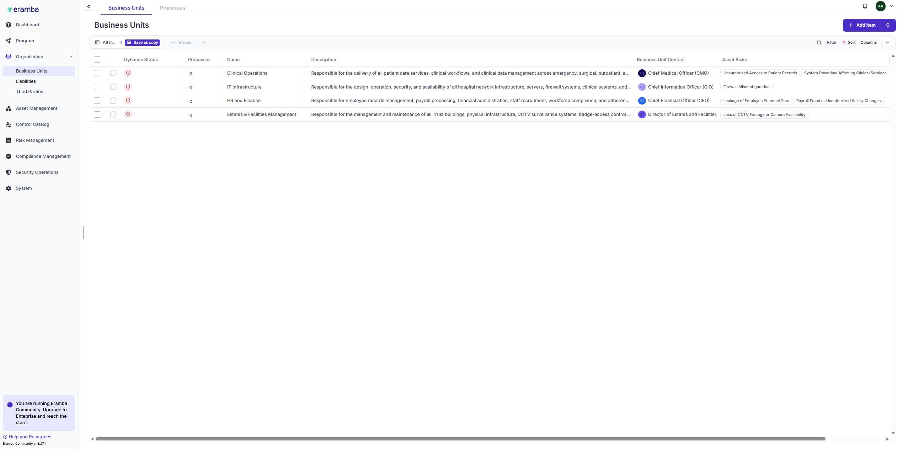
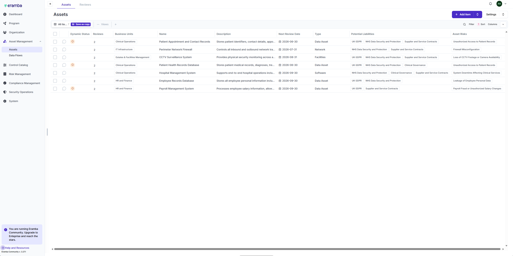
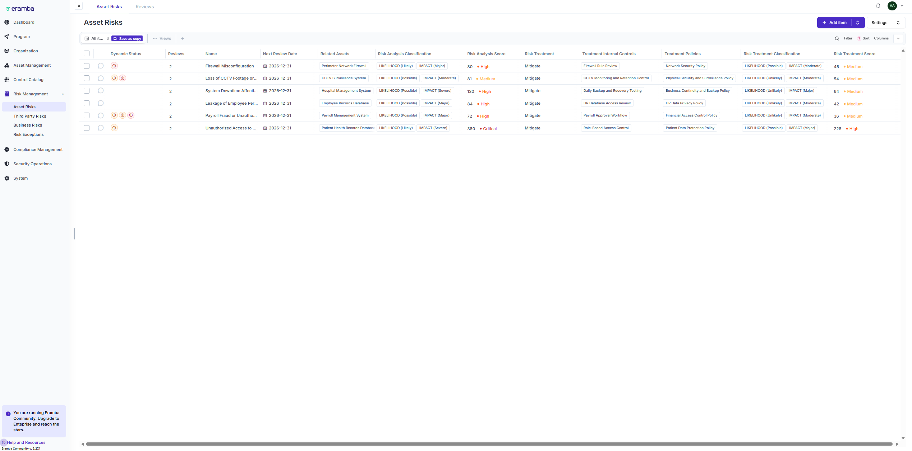
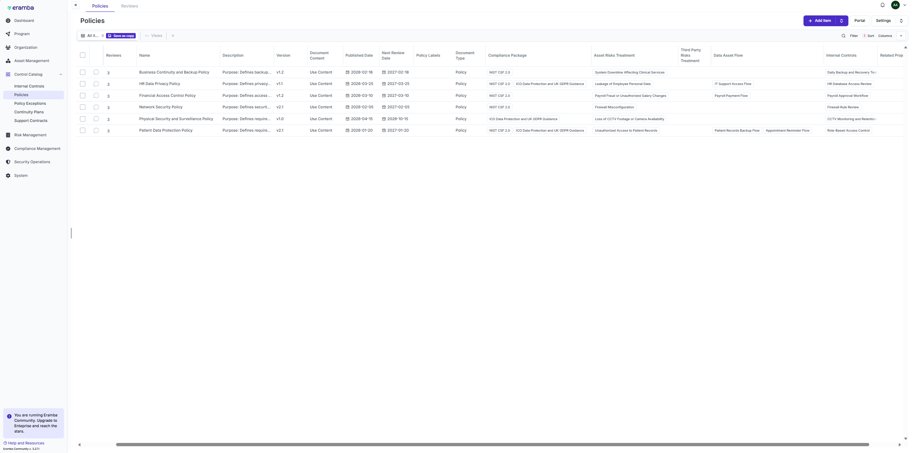
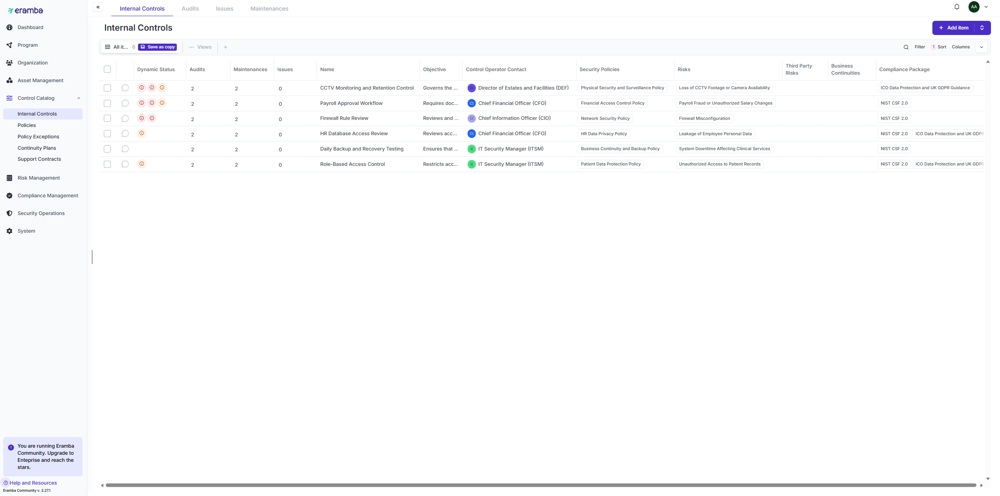
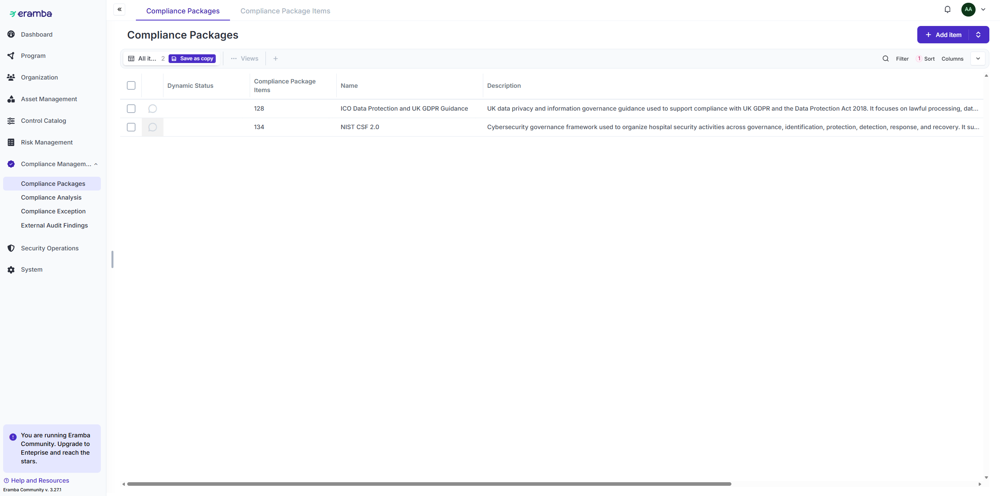
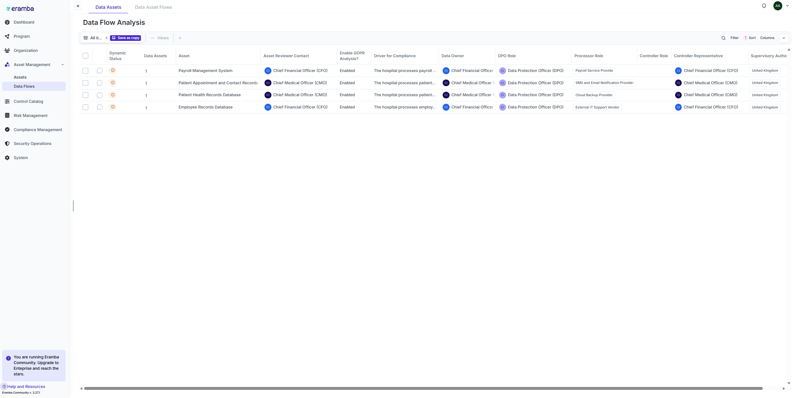
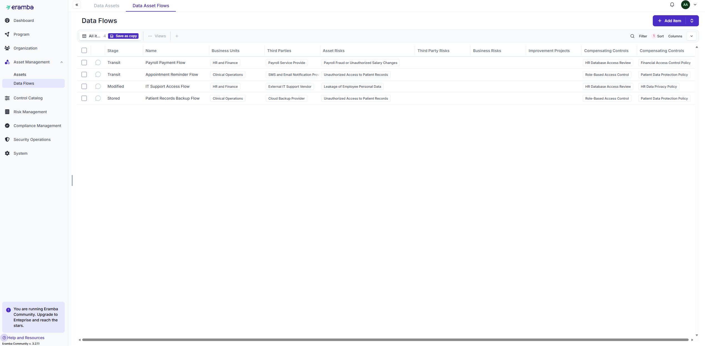
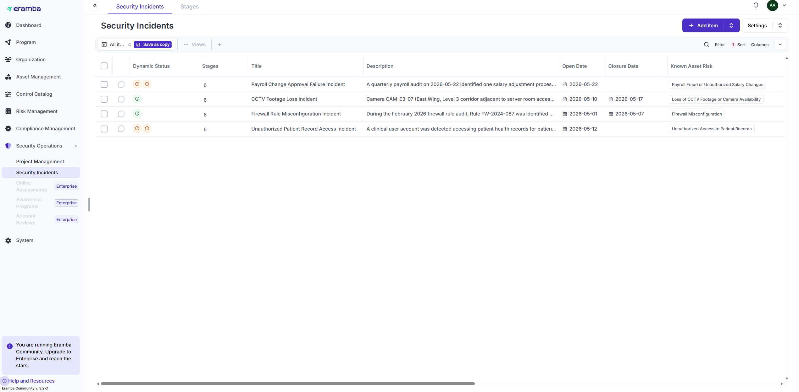
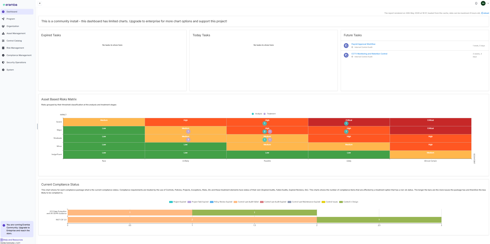

<div align="center">

# 🛡️ Real-Time GRC System Design & Implementation using Eramba

### Governance, Risk & Compliance (GRC) Project

Eramba • Risk Management • Compliance Analysis • GDPR • Incident Management


</div>

---

# Overview

This project demonstrates the design and implementation of a centralized Governance, Risk, and Compliance (GRC) environment using the Eramba platform.

The project was developed for a healthcare organization (St Thomas' Hospital) to manage cybersecurity risks, compliance obligations, privacy requirements, internal controls, and incident management activities.

The implementation follows industry best practices and aligns with NIST Cybersecurity Framework (CSF) 2.0 and UK GDPR requirements to improve organizational governance, risk visibility, regulatory compliance, and security resilience.

---

# Organization Profile

## Organization

**St Thomas' Hospital**

## Industry

Healthcare / Hospital Sector

## Business Objectives

- Protect patient health records
- Maintain regulatory compliance
- Reduce cybersecurity risks
- Improve governance processes
- Strengthen incident response capabilities
- Ensure data privacy and accountability

---

# Technologies Used

## GRC Platform

- Eramba 3.27.3

## Compliance Frameworks

- NIST Cybersecurity Framework (CSF) 2.0
- UK GDPR
- ICO Data Protection Guidance

## Risk Management

- Asset-Based Risk Assessment
- Risk Appetite Matrix
- Risk Treatment Planning

## Privacy Management

- GDPR Data Asset Management
- Processing Activities
- Third-Party Management
- Data Flow Mapping

## Incident Management

- Security Incident Tracking
- Incident Lifecycle Management
- Lessons Learned Process

---

# Project Architecture


---

# GRC Implementation Overview

```text
Business Units
      │
      ▼
Assets
      │
      ▼
Risks
      │
      ▼
Policies & Controls
      │
      ▼
Compliance Requirements
      │
      ▼
Privacy Management
      │
      ▼
Incident Management
      │
      ▼
Dashboard Reporting
```

---

# Task 1 – Organization Setup

## Business Units

Three business units were created within Eramba:

- Clinical Operations
- Information Technology
- HR & Finance



---

## Assets

Five organizational assets were identified and classified.

Examples:

- Patient Health Records Database
- Payroll Management System
- CCTV Monitoring System
- Hospital Network Infrastructure
- Patient Appointment System



---

# Task 2 – Risk Management

## Risk Register

Five asset-based cybersecurity risks were identified and assessed.

Examples:

- Unauthorized Patient Record Access
- Firewall Misconfiguration
- Payroll Fraud
- Loss of CCTV Footage
- Ransomware Attack



---

## Risk Appetite Matrix

Likelihood and impact values were configured to prioritize organizational risks.


---

## Risk Treatment Plans

Treatment plans were created for high-priority risks.


---

# Task 3 – Policy Management

## Policies

Four security policies were implemented:

- Access Control Policy
- Information Security Policy
- Backup & Recovery Policy
- Incident Response Policy



---

## Policy Reviews & Versions

Policy version history and review cycles were documented.


---

# Task 4 – Internal Controls

## Internal Controls

Implemented controls include:

- Role-Based Access Control
- Firewall Rule Review
- Daily Backup Verification
- CCTV Monitoring Review



---

## Audit Records

Control effectiveness was validated through audit activities.


---

## Maintenance Records

Control maintenance schedules were documented.


---

# Task 5 – Compliance Analysis

## NIST CSF 2.0 Mapping

Compliance requirements were mapped against NIST CSF 2.0.



---

## UK GDPR Compliance

Privacy and data protection requirements were assessed against UK GDPR guidance.


---

# Task 6 – Data Privacy Management

## Privacy-Focused Data Assets

Three GDPR-sensitive data assets were created:

- Patient Health Records Database
- Patient Appointment Records
- Employee Records Database



---

## Processing Activities

GDPR processing activities were documented.


---

## Third Parties

Third-party organizations involved in data processing were registered.

Examples:

- Payroll Service Provider
- Cloud Backup Provider
- SMS Notification Provider


---

## Data Flows

Personal data movement between systems and third parties was documented.



---

# Task 7 – Incident Management

## Security Incidents

Four security incidents were created and tracked.

Examples:

- Unauthorized Patient Record Access
- Firewall Rule Misconfiguration
- Payroll Approval Failure
- CCTV Footage Loss



---

## Incident Lifecycle

Each incident followed:

```text
Identification
      │
      ▼
Containment
      │
      ▼
Eradication
      │
      ▼
Recovery
      │
      ▼
Communication
      │
      ▼
Lessons Learned
```


---

# Task 8 – Dashboard & Reporting

## Asset-Based Risk Matrix

Visual representation of organizational risks.



---

## Compliance Status Dashboard

Overview of compliance posture across frameworks.


---

# Key Findings

| Finding | Severity |
|----------|----------|
| Unauthorized Patient Record Access | Critical |
| Missing ICO Breach Notification Procedure | High |
| Firewall Misconfiguration | High |
| Payroll Approval Workflow Failure | Medium |
| CCTV Monitoring Control Failure | Medium |

---

# Skills Demonstrated

## Governance

- Governance Framework Design
- Risk Governance
- Compliance Management

## Risk Management

- Asset-Based Risk Assessment
- Risk Analysis
- Risk Treatment Planning

## Compliance

- NIST CSF 2.0 Mapping
- UK GDPR Compliance
- Regulatory Gap Analysis

## Privacy

- GDPR Data Mapping
- Processing Activities
- Third-Party Management
- Data Flow Analysis

## Incident Management

- Incident Lifecycle Management
- Incident Documentation
- Root Cause Analysis

## GRC Platform

- Eramba Administration
- Dashboard Configuration
- Reporting & Auditing

---

# Repository Structure

```text
it8515-eramba-grc-project
│
├── README.md
│
├── images
│   ├── grc-architecture.png
│   ├── business-units.png
│   ├── assets-list.png
│   ├── risk-register.png
│   ├── risk-matrix.png
│   ├── risk-treatment-plan.png
│   ├── policies.png
│   ├── policy-versions.png
│   ├── internal-controls.png
│   ├── control-audits.png
│   ├── maintenance-records.png
│   ├── nist-compliance.png
│   ├── gdpr-compliance.png
│   ├── data-assets.png
│   ├── processing-activities.png
│   ├── third-parties.png
│   ├── data-flows.png
│   ├── incident-register.png
│   ├── incident-lifecycle.png
│   ├── dashboard-risk-matrix.png
│   └── compliance-dashboard.png
```

---

# Key Frameworks

- NIST Cybersecurity Framework (CSF) 2.0
- UK GDPR
- ICO Data Protection Guidance
- Enterprise Risk Management Principles

---
